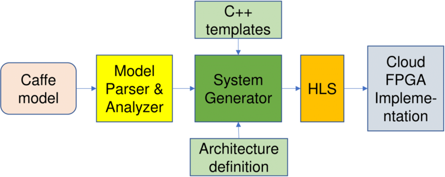

# Cloud-Dnn

## Introduction

Cloud-Dnn is an open-source framework that maps DNN models trained by Caffe to FPGAs in the cloud for inference acceleration. It generates C++ network description as well as the final hardware accelerator IPs with the input *.prototxt DNN description. The structural optimization for FPGA implementation is provided during the synthesizable code generation. The purpose of this Cloud-Dnn is to take the advantage of HLS design methodology, and to provide more flexible and user-friendly DNN acceleration on cloud-FPGAs (e.g., AWS F1).


### Hardware settings
- Local cluster
-UltraScale+ VU118 board with PCIe connection
- AWS cluster
-AWS F1.2Xlarge instance

### OS settings
- Local cluster
-Ubuntu 16.04
- AWS cluster
-FPGA development system image (Centos 7.6)

### Software requirement
- Python 3.5
- gcc g++
- Xilinx vivado_hls 2018.2 (2018.2.op for AWS)
- Xilinx vivado 2018.2 (2018.2.op for AWS)
- Caffe and the required libraries (including Pycaffe)
- aws-fpga repo
- Drivers
-Local: XDMA driver for UltraScale+ VU118 board
-AWS: AWS shell IP support, EDMA(XDMA for the latest version of AWS shell) driver


<details>
<summary><big><strong>GitHub Repository Structure</strong></big></summary>

```sh
Open-Dnn/
|
|-- LICENSE
|-- README.md
|-- netGenerator
|   |-- paramExtractor
|   |-- dse
|   `-- netGen
|-- scripts
|   |-- compile
|   |-- hls_impl
|   `-- sys_gen
|-- acc_runtime
|   |-- local_acc
|   `-- aws_acc
|-- fpga_cnn
|   |-- src
|   `-- testbench
|-- docs
`-- examples
```
</details>


## Brief Manual

### Steps briefing

<p align="center">
  
</p>

Building an accelerator system for either local cluster or AWS cluster both requires:

1. DNN description analysis

1. C++ accelerator description generation

1. Accelerator IP generation with vivado_hls

1. Accelerator system configuration

1. Host function construction and compilation

The generation processes are the same before step 4. The differences in the rest of the steps are explained with the detailed operations below.


### Build accelerator system

Please follow the steps with a given alex.prototxt file and a trained alex.caffemodel to build your accelerator system. Make sure your environment is well set before starting this manual.

1. Generating C++ accelerator description. After the repo is downloaded (no need for the *.caffemodel file for now)
	```sh
	cd Open-Dnn/netGenerator
    ./run_generator.sh -i alex.prototxt
    ```
run_generator.sh will automatically extract, analyze and generate the C++ code with the given alex.prototxt file. Since the alex.prototxt is given as the repo file, please only download the alex.caffemodel before executing the runtime software.

   >**:pushpin: TIPS:**
   > - The run_generator.sh includes all the steps before generating the accelerator IPs: parameter extraction, parameter analysis and C++ code generation. If the process doesn't work with your input model description, please hack the intermediate files copied or moved after every stage in the run_generator.sh to generate your own design.
   > - The steps in the run_generator.sh script could also be executed one by one with the scripts mentioned for each of the steps with the corresponding input files.
   > - The intermediate files for alex.prototxt are provided in the examples/ folder, please copy them to the corresponding location to run the generation step by step if your system is constrained with the software environmental supports.
   > - The parameter extract script is sensitive to the format of the name\type in the prototxt file. The current version only supports the word with the first letter capitalized and with "" symbol for it.

2. Generating accelerator IPs. After the run_generator.sh script is executed successfully, the generated project is named as gen_proj and located at Open-Dnn/gen_proj.
	```sh
    cd ../gen_proj/hls_proj
    ./syn.sh
	```
syn.sh will generate the 3 sub-net IPs with the C++ code and scripts generated from previous step. One could also hack the accelerator configurations in the acc_instance.h and call the testbench classes to verify the correctness of your change.

   >**:pushpin: TIPS:**
   > - For co-sim, please uncomment the iteration in the hls_script.tcl. Current hls_script.tcl is simplified for IP generation.
   > - The provided ff_test.cpp includes a simple testbench for the first sub_net function, which is sub_net_0, please modify and uncomment the others if you need to run co-sim for them. (It will be generated automatically in a future version.)

3. Accelerator system construction. The system construction scripts are provided within the generated project folder gen_proj/impl_proj. Before constructing the accelerator system, make sure the environment is well set and the sub-net IPs are generated and located properly.
   - Local Cluster
	```sh
    cd ../impl_proj/local_impl/
    *(specify the path of the generated IPs in the build_system_local.tcl)
    use vivado tcl console to call build_system_local.tcl (either in tcl console or with terminal mode)
	```

   >**:pushpin: TIPS:**
   > - You could also manually build your own accelerator system by taking the system_overview_local.pdf in the Open-Dnn/docs/ folder as a reference.
   > - Remember to specify the interface latency as 3 for the URAMs in the system.
   > - Please be aware of the clocks in the system overview.


   - AWS F1

   Before starting this step, please make sure the IPI design examples in the aws-fpga repo could be excuted correctly. Follow the IPI design flow provided by it.
	```sh
    mkdir ~/aws-fpga/hdk/cl/examples/aws_acc_ipi
    cp ../impl_proj/aws_impl/* ~/aws-fpga/hdk/cl/examples/aws_acc_ipi
    *(Specify the path of the generated IPs in the build_system_aws.tcl)
    use vivado to call build_system_aws.tcl (tcl console or terminal)
	```

   >**:pushpin: TIPS:**
   > - You could also manually build your own accelerator system by taking the system_overview_aws.pdf in the Open-Dnn/docs/ folder as a reference.
   > - Remember to specify the interface latency as 3 for the URAMs in the system.
   > - Please be aware of the clocks in the system overview.


4. Runtime software compilation.
   - Local Cluster

   After the bitstream of the accelerator system is generated and downloaded to the UltraScale+ VU118 board, copy the acc_runtime/local_acc/ folder to your prefered execution path. Copy the config.h file from the gen_proj/hls_proj/src/ to the local_acc/ folder. Run compilation to get the executable file.

   - AWS F1

   After the AGFI (follow the instructions for AWS F1 AGFI generation) of the accelerator system is generated and downloaded to the AWS F1 instance (Follow the aws-fpga development process). Copy the acc_runtime/aws_acc/ folder to your prefered execution path. Copy the config.h file from the gen_proj/hls_proj/src/ to the aws_acc/ folder. Run compilation to get the executable file.


### Play With Demos


<details>
<summary><strong>Playing with given demos on local cluster</strong></summary>

Please follow the steps to play with a given demo with bitstream and runtime software.


</details>

<details>
<summary><strong>Playing with given demos on AWS F1</strong></summary>

Please follow the steps to play with a given demo with AGFI and runtime software.


</details>


## Additional Resources

For more details, please refer to the paper below.

```sh
@inproceedings{Chen2019fpga,
 author = {Chen, Yao and He, Jiong and Zhang, Xiaofan and Hao, Cong and Chen, Deming},
 title = {Cloud-DNN: An Open Framework for Mapping DNN Models to Cloud FPGAs},
 booktitle = {Proceedings of the 2019 ACM/SIGDA International Symposium on Field-Programmable Gate Arrays},
 series = {FPGA '19},
 year = {2019},
 isbn = {978-1-4503-6137-8},
 location = {Seaside, CA, USA},
 pages = {73--82},
 numpages = {10},
 url = {http://doi.acm.org/10.1145/3289602.3293915},
 doi = {10.1145/3289602.3293915},
 acmid = {3293915},
 publisher = {ACM},
 address = {New York, NY, USA},
 keywords = {cloud computing, dnn accelerator, fpga, high-level synthesis, neural network, reconfiguration}
}
```
